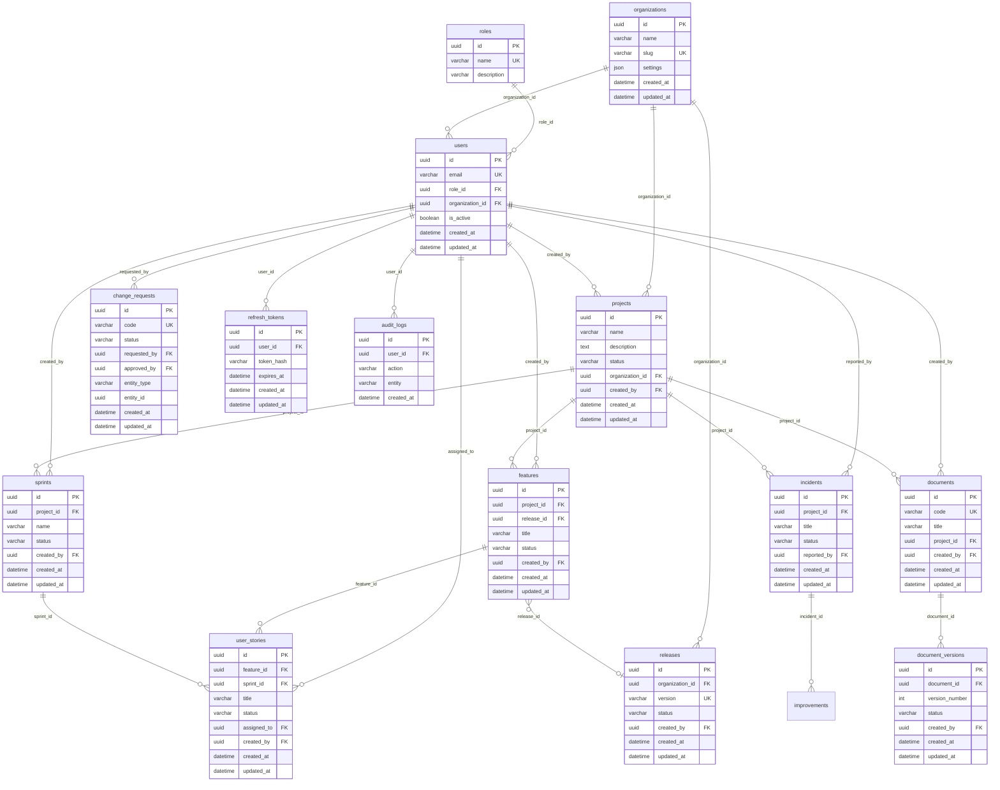

# Modelo de base de datos — NEXUS DevSuite

**Origen:** Migraciones en `src/infrastructure/db/migrations/`.  
**Motor:** MySQL / MariaDB (Sequelize).  
**Objetivo:** Documentar el modelo entidad-relación y cómo generar un diagrama ER profesional para imprimir o presentar.

---

## 1. Resumen del modelo que tenemos

NEXUS DevSuite usa un modelo **relacional** con estas entidades principales:

| Entidad | Tabla | Descripción |
|--------|--------|-------------|
| **Rol** | `roles` | Roles del sistema (MASTER, EMPLOYEE, etc.). |
| **Usuario** | `users` | Usuarios; pertenecen a un rol y opcionalmente a una organización. |
| **Organización** | `organizations` | Tenant/organización; agrupa usuarios, proyectos y releases. |
| **Proyecto** | `projects` | Proyectos de desarrollo; pertenecen a una organización. |
| **Feature** | `features` | Features de un proyecto; pueden estar en un release. |
| **User Story** | `user_stories` | Historias de usuario de una feature; pueden asignarse a un sprint. |
| **Sprint** | `sprints` | Sprints de un proyecto. |
| **Release** | `releases` | Releases de la organización; agrupan features. |
| **Incidente** | `incidents` | Incidentes por proyecto. |
| **Mejora** | `improvements` | Mejoras; opcionalmente ligadas a proyecto e incidente. |
| **Documento** | `documents` | Documentos; opcionalmente ligados a proyecto. |
| **Versión de documento** | `document_versions` | Versiones de un documento. |
| **Change Request** | `change_requests` | Solicitudes de cambio (vinculadas a feature o release por entity_type/entity_id). |
| **Refresh token** | `refresh_tokens` | Tokens de refresco por usuario. |
| **Auditoría** | `audit_logs` | Log de acciones por usuario. |

**Relaciones principales:**  
Usuario → Rol (N:1). Usuario → Organización (N:1). Organización → Proyectos, Releases (1:N). Proyecto → Features, Sprints, Incidents (1:N). Feature → User Stories (1:N). User Story → Sprint (N:1 opcional). Release → Features (1:N). Document → Document Versions (1:N). Improvement → Project, Incident (N:1 opcional). Change Request → User (solicitante, aprobador).

---

## 2. Cómo generar un ERD super profesional (como en la imagen)

Tienes **tres opciones** prácticas para obtener un diagrama entidad-relación de nivel presentación/imprimible.

### Opción A — dbdiagram.io (recomendada, resultado tipo “imagen”)

1. Entra en **https://dbdiagram.io**
2. Borra el contenido de la izquierda y pega el **código DBML** de la sección 3 de este documento.
3. El diagrama se genera a la derecha al instante.
4. **Exportar:** menú **Export** → **Export as PNG** o **Export as PDF** (alta resolución para imprimir).
5. Ajusta zoom y disposición antes de exportar si quieres una sola hoja.

Ventaja: notación clara, PK/FK y relaciones visibles, muy parecido al estilo de tu referencia.

### Opción B — Draw.io (diagrams.net)

1. Entra en **https://app.diagrams.net** (o instala la app de escritorio).
2. Crea un diagrama nuevo → **Arrange** → **Insert** → **Advanced** → **Entity Relation** (o usa formas “Rectangle” para entidades y rombos para relaciones si prefieres ER clásico).
3. Dibuja cada tabla como un bloque; dentro anota atributos, PK, FK.
4. Conecta con flechas y etiqueta cardinalidad (1, N).
5. **Exportar:** **File** → **Export as** → **PNG** o **PDF** (aumenta DPI para imprimir, ej. 300).

Ventaja: control total del diseño y estilo.

### Opción C — Mermaid (en repo y luego exportar a imagen)

1. En este repo está el **bloque Mermaid** en la sección 4; puedes verlo en cualquier visor de Markdown que soporte Mermaid (GitHub, VS Code con extensión, etc.).
2. Para **imprimir en alta calidad:** usa el **Mermaid Live Editor** (https://mermaid.live), pega el código de la sección 4, y exporta **PNG** o **SVG** desde el menú.
3. Si hace falta, convierte SVG a PDF con cualquier herramienta (navegador: abrir SVG → Imprimir → Guardar como PDF).

Ventaja: diagrama versionado en el repo y fácil de actualizar.

---

## 3. Código DBML para dbdiagram.io (pegar y exportar)

Copia todo el bloque siguiente en https://dbdiagram.io/d (panel izquierdo) y usa **Export** para PNG/PDF.

```dbml
// NEXUS DevSuite — Modelo de base de datos
// Pegar en https://dbdiagram.io y exportar PNG/PDF

Table roles {
  id uuid [pk]
  name varchar(50) [not null, unique]
  description varchar(255)
}

Table users {
  id uuid [pk]
  email varchar(255) [not null, unique]
  password_hash varchar(255) [not null]
  role_id uuid [not null, ref: > roles.id]
  organization_id uuid [ref: > organizations.id]
  is_active boolean [not null, default: true]
  created_at datetime [not null]
  updated_at datetime [not null]
}

Table organizations {
  id uuid [pk]
  name varchar(255) [not null]
  slug varchar(100) [not null, unique]
  settings json
  plan varchar(50)
  billing_email varchar(255)
  next_billing_date date
  created_at datetime [not null]
  updated_at datetime [not null]
}

Table projects {
  id uuid [pk]
  name varchar(255) [not null]
  description text [not null]
  status varchar(20) [not null, note: 'ACTIVE|ARCHIVED']
  organization_id uuid [ref: > organizations.id]
  created_by uuid [not null, ref: > users.id]
  archived_at datetime
  created_at datetime [not null]
  updated_at datetime [not null]
}

Table features {
  id uuid [pk]
  project_id uuid [not null, ref: > projects.id]
  release_id uuid [ref: > releases.id]
  title varchar(500) [not null]
  description text [not null]
  status varchar(30) [not null]
  priority varchar(20) [not null]
  created_by uuid [not null, ref: > users.id]
  approved_by uuid [ref: > users.id]
  approved_at datetime
  closed_at datetime
  created_at datetime [not null]
  updated_at datetime [not null]
}

Table user_stories {
  id uuid [pk]
  feature_id uuid [not null, ref: > features.id]
  sprint_id uuid [ref: > sprints.id]
  title varchar(500) [not null]
  description text [not null]
  acceptance_criteria json
  status varchar(30) [not null]
  priority varchar(20) [not null]
  assigned_to uuid [ref: > users.id]
  created_by uuid [not null, ref: > users.id]
  approved_by uuid [ref: > users.id]
  closed_at datetime
  created_at datetime [not null]
  updated_at datetime [not null]
}

Table sprints {
  id uuid [pk]
  project_id uuid [not null, ref: > projects.id]
  name varchar(255) [not null]
  goal text
  start_date date
  end_date date
  status varchar(20) [not null]
  created_by uuid [not null, ref: > users.id]
  closed_by uuid [ref: > users.id]
  closed_at datetime
  created_at datetime [not null]
  updated_at datetime [not null]
  deleted_at datetime
}

Table releases {
  id uuid [pk]
  organization_id uuid [ref: > organizations.id]
  version varchar(50) [not null, unique]
  status varchar(30) [not null]
  description text
  created_by uuid [not null, ref: > users.id]
  released_at datetime
  created_at datetime [not null]
  updated_at datetime [not null]
  deleted_at datetime
}

Table incidents {
  id uuid [pk]
  project_id uuid [not null, ref: > projects.id]
  title varchar(255) [not null]
  description text
  severity varchar(20) [not null]
  status varchar(20) [not null]
  root_cause_analysis text
  reported_by uuid [not null, ref: > users.id]
  assigned_to uuid [ref: > users.id]
  closed_by uuid [ref: > users.id]
  closed_at datetime
  created_at datetime [not null]
  updated_at datetime [not null]
  deleted_at datetime
}

Table improvements {
  id uuid [pk]
  project_id uuid [ref: > projects.id]
  incident_id uuid [ref: > incidents.id]
  title varchar(255) [not null]
  description text
  status varchar(30) [not null]
  proposed_by uuid [not null, ref: > users.id]
  approved_by uuid [ref: > users.id]
  approved_at datetime
  implemented_at datetime
  created_at datetime [not null]
  updated_at datetime [not null]
  deleted_at datetime
}

Table documents {
  id uuid [pk]
  code varchar(50) [not null, unique]
  title varchar(255) [not null]
  description text
  project_id uuid [ref: > projects.id]
  created_by uuid [not null, ref: > users.id]
  created_at datetime [not null]
  updated_at datetime [not null]
  deleted_at datetime
}

Table document_versions {
  id uuid [pk]
  document_id uuid [not null, ref: > documents.id]
  version_number int [not null]
  status varchar(20) [not null]
  change_reason text
  content text
  created_by uuid [not null, ref: > users.id]
  approved_by uuid [ref: > users.id]
  approved_at datetime
  created_at datetime [not null]
  updated_at datetime [not null]
  deleted_at datetime
}

Table change_requests {
  id uuid [pk]
  code varchar(50) [not null, unique]
  title varchar(255)
  description text
  type varchar(20)
  impact_level varchar(20)
  status varchar(30) [not null]
  requested_by uuid [not null, ref: > users.id]
  approved_by uuid [ref: > users.id]
  entity_type varchar(20) [not null]
  entity_id uuid [not null]
  approved_at datetime
  implemented_at datetime
  created_at datetime [not null]
  updated_at datetime [not null]
  deleted_at datetime
}

Table refresh_tokens {
  id uuid [pk]
  user_id uuid [not null, ref: > users.id]
  token_hash varchar(128) [not null]
  expires_at datetime [not null]
  revoked boolean [not null, default: false]
  created_at datetime [not null]
  updated_at datetime [not null]
}

Table audit_logs {
  id uuid [pk]
  user_id uuid [ref: > users.id]
  action varchar(100) [not null]
  entity varchar(100) [not null]
  entity_id varchar(100)
  metadata json
  ip_address varchar(64)
  user_agent varchar(255)
  created_at datetime [not null]
}
```

---

## 4. Código Mermaid (para GitHub / Mermaid Live / exportar imagen)

Pega este bloque en **https://mermaid.live** y exporta PNG o SVG para imprimir o insertar en documentos.



---

## 5. Resumen rápido “cómo imprimir un ERD profesional”

1. **Modelo que tenemos:** El descrito en la sección 1 (y en las migraciones de `src/infrastructure/db/migrations/`).
2. **Herramienta más rápida:** **dbdiagram.io** + código DBML de la sección 3 → Export as PNG/PDF.
3. **Para máximo control visual:** **Draw.io** → dibujar entidades y relaciones a mano → Export as PNG/PDF (DPI alto).
4. **Para tener el diagrama en el repo y exportar:** Usar el **Mermaid** de la sección 4 en Mermaid Live → exportar PNG/SVG.

Con cualquiera de estas opciones puedes obtener un diagrama entidad-relación claro y listo para imprimir o presentar, al estilo de la imagen de referencia.
